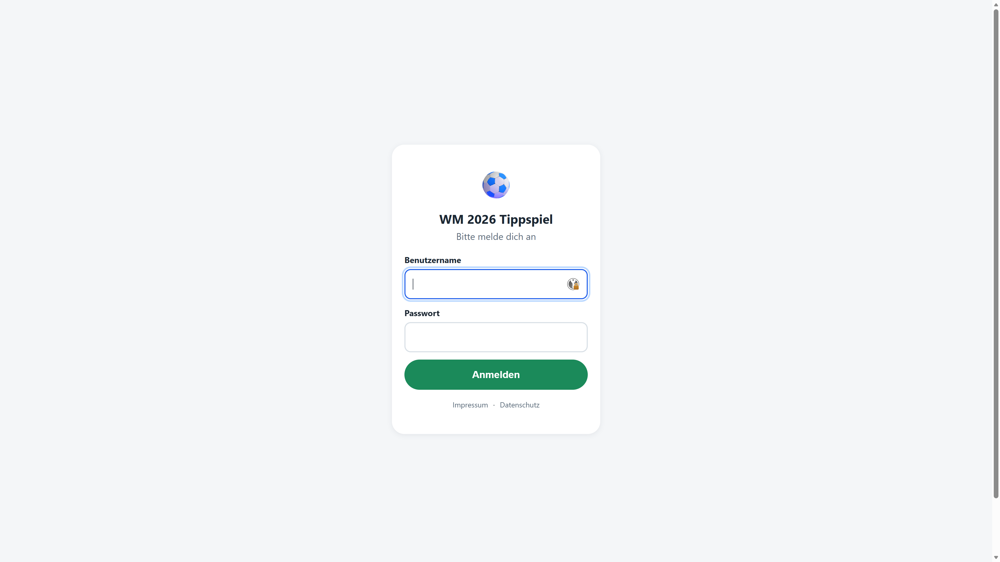
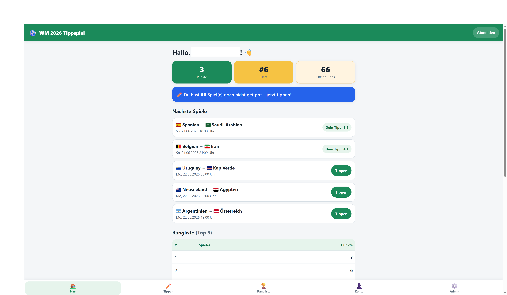
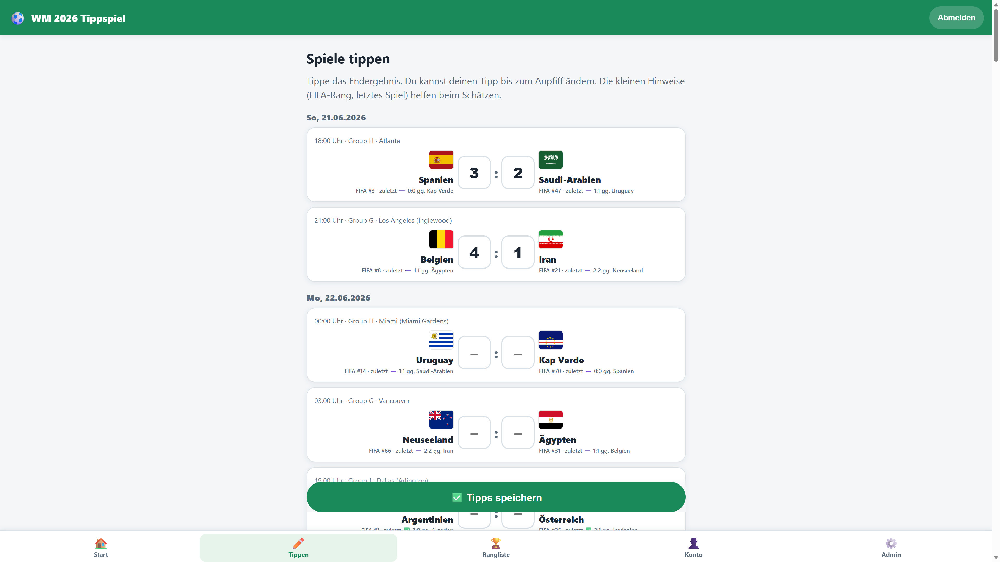
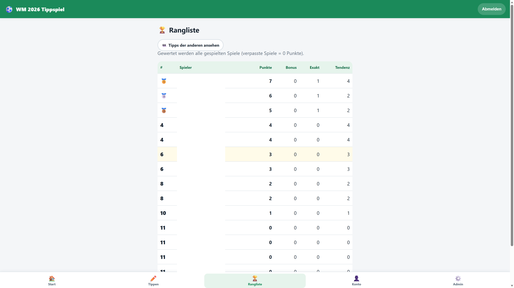
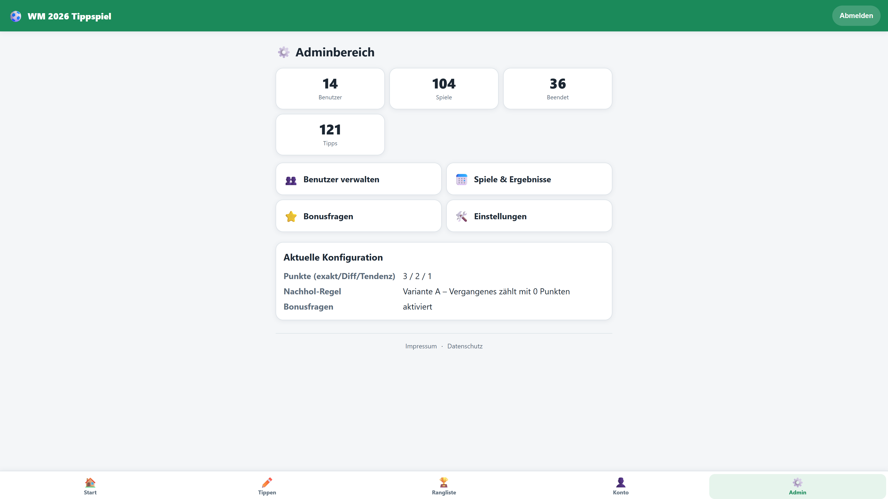

# ⚽ WM 2026 Tippspiel

Ein einfaches, kinderfreundliches **Familien-Tippspiel** zur FIFA Fußball-
Weltmeisterschaft 2026. Tippt gemeinsam Spielergebnisse, sammelt Punkte und
messt euch in der Rangliste – im Browser auf Smartphone und PC, ganz ohne
App-Installation.

> Entwickelt mit **PHP 8.2**, **SQLite/MariaDB** und **Vanilla JavaScript** –
> bewusst ohne Framework-Ballast, Docker oder Node.js. Läuft auf jedem
> klassischen Apache-Webspace.

---

## ✨ Funktionen

* **Kinderleichte Bedienung** – große Buttons, große Zahlenfelder, klare
  Sprache. Auch für Kinder ab 9 Jahren problemlos nutzbar.
* **Mehrsprachig (Deutsch / Portugiesisch)** – Sprache je Benutzer wählbar
  (Konto → Sprache) mit Umschalter auf der Login-Seite; inkl. übersetzter
  Ländernamen.
* **Drei Ansichten (Designs)** – je Benutzer wählbar (Konto → Ansicht oder
  durch den Admin): **Standard**, **Kinder** (extra groß und bunt, für junge
  Mitspieler) und **Modern** (dunkles Design mit dezenten Animationen).
* **Automatisches Speichern** – Tipps werden beim Eintippen automatisch
  gespeichert (ohne Speichern-Button); ohne JavaScript erscheint ein
  klassischer Button als Fallback.
* **Ländernamen + Flaggen** – Mannschaftsnamen in der gewählten Sprache und
  lokale SVG-Flaggen (anpassbar in `src/Data/teams.php`), damit auch
  Lese-Anfänger die Teams erkennen. Keine externen Server zur Laufzeit.
* **Tipphilfen** – pro Mannschaft FIFA-Weltranglistenplatz und letztes
  Spielergebnis, damit auch Kinder Anhaltspunkte für ihren Tipp haben.
* **Gruppen & Turnierbaum** – Live-Gruppentabellen, beste Gruppendritte und ein
  KO-Turnierbaum mit Runden-Tabs und stufenweisem Wischen (Handy). Das
  Sechzehntelfinale zeigt die Paarungen laut aktuellem Tabellenstand – inklusive
  der acht besten Gruppendritten, die über die offizielle FIFA-Zuordnungstabelle
  ihrem jeweiligen Spiel zugeordnet werden, sobald die Achtergruppe feststeht.
* **Tipps der anderen** – Übersicht aller Mitspieler-Tipps, fair erst **nach
  Anpfiff** sichtbar.
* **Sichere Updates** – versioniertes Migrationssystem; bestehende Daten bleiben
  bei Aktualisierungen erhalten (siehe **[UPDATE.md](UPDATE.md)**).
* **Dashboard** – nächste Spiele, eigene offene Tipps, aktuelle Rangliste und
  Punkteübersicht auf einen Blick.
* **Tippen** – pro Spiel Heim- und Auswärtstore eintippen; Tippschluss ist der
  Anpfiff. Bereits gespielte Spiele sind gesperrt.
* **Automatischer Spielplan-Import** aus einer kostenlosen, öffentlichen Quelle
  ([OpenFootball](https://github.com/openfootball/worldcup.json), kein API-Key)
  – inkl. **JSON-/CSV-Fallback** und manuellem Import.
* **Ergebnisse** automatisch per Cronjob **oder** manuell durch den Admin.
* **Faire Nachhol-Regel** für einen Start während der laufenden WM
  (Variante A: Vergangenes zählt mit 0 Punkten · Variante B: Wertung erst ab
  Beitritt).
* **Konfigurierbares Punktesystem** (exaktes Ergebnis / Tordifferenz / Tendenz).
* **Rangliste** mit Platz, Punkten, exakten Tipps und richtigen Tendenzen.
* **Bonusfragen** (Weltmeister, Finalist, Torschützenkönig …), optional
  aktivierbar, mit konfigurierbaren Punkten.
* **Adminbereich** – Benutzer, Spiele, Ergebnisse, Bonusfragen und Einstellungen
  verwalten; Punkte neu berechnen. **Tipps nachtragen**: für einzelne Spieler
  verspätete Tipps ergänzen oder korrigieren (auch nach Anpfiff); bei beendeten
  Spielen werden die Punkte sofort neu berechnet.
* **Sicher** – Passwort-Hashing (`password_hash`), CSRF-Schutz, gehärtetes
  Session-Management, serverseitige Input-Validierung.
* **Responsive & barrierearm** – mobil-first, hoher Kontrast, große Touch-Flächen.

---

## 🧭 Navigation (für Spieler)

| Bereich | Inhalt |
|---------|--------|
| 🏠 **Start** | Dashboard mit Überblick |
| ✏️ **Tippen** | Kommende Spiele tippen |
| 🏟️ **Turnier** | Gruppentabellen & KO-Turnierbaum |
| 🏆 **Rangliste** | Aktuelle Tabelle (+ „Tipps der anderen") |
| 👤 **Konto** | Profil, Sprache, Passwort, Bonus-Tipps |
| ⚙️ **Admin** | nur für Administratoren |

---

## 🏆 Punkte-System (Standard, konfigurierbar)

| Tipp | Punkte |
|------|:------:|
| Exaktes Ergebnis | **3** |
| Richtige Tordifferenz (kein Remis) | **2** |
| Richtiger Sieger / Unentschieden | **1** |
| Falsch | **0** |

Sortierung der Rangliste: **Punkte → exakte Ergebnisse → richtige Tendenzen**.

> In der K.-o.-Phase wird – wie bei den meisten Tippspielen – auf den **Stand
> nach 90 Minuten** gewertet. Eine Verlängerung oder ein Elfmeterschießen ändert
> den Tipp also nicht (es bleibt das reguläre Ergebnis bzw. ein Remis). Im
> Turnierbaum rückt der Sieger trotzdem korrekt nach; solche Spiele sind mit
> **„n.V."** (nach Verlängerung) bzw. **„i.E."** (im Elfmeterschießen) markiert.

---

## 🚀 Schnellstart

```bash
# 1) Konfiguration anlegen
cp config/config.example.php config/config.php   # danach anpassen

# 2) Datenbank einrichten
php database/migrate.php
php database/seed.php          # legt Admin (admin / admin123) an

# 3) Lokal testen (Entwicklung)
php -S localhost:8000 -t public
#   -> http://localhost:8000  (Login: admin / admin123)
```

Für die Produktivinstallation auf Apache siehe **[INSTALL.md](INSTALL.md)**.
Für das Aktualisieren einer bestehenden Installation siehe **[UPDATE.md](UPDATE.md)**.

> ⚠️ Standard-Admin-Passwort nach dem ersten Login ändern!

---

## 🗂️ Projektstruktur

```
tippspiel/
├── public/                 # Apache DocumentRoot (Front-Controller + Assets)
│   ├── index.php           # Einstiegspunkt / Router-Bootstrap
│   ├── .htaccess           # Rewrite auf index.php + Security-Header
│   └── assets/             # CSS, JS, Bilder
├── src/
│   ├── bootstrap.php       # Autoloader, Config, DB-Init
│   ├── helpers.php         # globale Hilfsfunktionen (url, e, csrf, t, tname, flag …)
│   ├── Core/               # Database, Router, Auth, Session, Csrf, View, Lang
│   ├── Models/             # User, MatchModel, Bet, Setting, BonusQuestion
│   ├── Services/           # Scoring, Standings, Schedule/Result-Import,
│   │                       #   TeamService, TipsService, GroupsService, BracketService
│   ├── Data/               # teams.php (DE/PT-Namen, FIFA-Rang, ISO-Code)
│   ├── Lang/               # Übersetzungen de.php / pt.php
│   └── Controllers/        # Auth/Dashboard/Bet/Standings/Tips/Tournament/
│                           #   Account/Legal + Admin/*
├── views/                  # PHP-Templates (Layout + Seiten + legal/)
├── config/                 # config.example.php (Vorlage)
├── database/               # Schema (SQLite+MySQL), migrate.php, seed.php
│   └── migrations/         # versionierte Migrationen (002_teams … 004_i18n)
├── bin/                    # Cron-/Pflege-Skripte (Import, Ergebnisse, Teams)
├── data/                   # SQLite-DB + Importdateien (nicht öffentlich)
├── INSTALL.md   UPDATE.md   RECHTLICHES.md
└── README.md
```

---

## 🔌 Datenquelle (APIs)

Primärquelle ist **OpenFootball worldcup.json** – Public Domain, kein API-Key,
keine Registrierung, eine einzige JSON-Datei mit Spielplan **und** Ergebnissen.
Sie wird per Cronjob aktualisiert. Die Architektur ist quellen-agnostisch:

* **Online-Import** (OpenFootball) – Standard
* **JSON-Import** – flaches Format oder OpenFootball-Format
* **CSV-Import** – `date,time,team1,team2,group,venue,score1,score2`
* **Manuelle Eingabe** – Ergebnisse jederzeit im Adminbereich pflegbar

Damit funktioniert das Tippspiel auch dann, wenn keine API erreichbar ist.

---

## 📸 Screenshots

> _Platzhalter – hier später eigene Screenshots einfügen._

| Login | Dashboard | Tippen |
|-------|-----------|--------|
|  |  |  |

| Rangliste | Adminbereich |
|-----------|--------------|
|  |  |

---

## 🔒 Sicherheit

* Passwörter werden mit `password_hash()` (bcrypt) gespeichert und bei Bedarf
  automatisch neu gehasht.
* Alle ändernden Aktionen sind durch **CSRF-Token** geschützt.
* Session-Cookies sind `HttpOnly`, `SameSite=Lax` und (bei HTTPS) `Secure`;
  die Session-ID wird beim Login erneuert.
* Sämtliche Ausgaben werden per `e()` HTML-escaped, alle Eingaben serverseitig
  validiert; Datenbankzugriffe ausschließlich über vorbereitete Statements.

---

## ⚖️ Rechtliches

Vorbereitet sind **Impressum** (`/impressum`) und **Datenschutzerklärung**
(`/datenschutz`), beide ohne Login erreichbar; die Betreiberangaben werden unter
**Admin → Einstellungen → Rechtliches** gepflegt. Eine Einschätzung (Impressum,
DSGVO, Glücksspiel, Marken) steht in **[RECHTLICHES.md](RECHTLICHES.md)**.

Flaggen stammen aus dem Set [flag-icons](https://github.com/lipis/flag-icons)
(MIT); die abgebildeten Nationalflaggen sind gemeinfrei.

---

## 📄 Lizenz

Zur freien privaten Nutzung im Familienkreis. Spieldaten von OpenFootball stehen
in der Public Domain.
